# Producto_Unidad-P2
Integrantes: Bryan Azuero, Javier Arteaga, Jhonatan Tituaña
### 1. PLANTEAMIENTO DEL PROBLEMA

En el siguiente informe se dará a conocer la interfaz HMI son parte importante para todos los procesos automatización, ya que es la manera en que las personas interactúan con las máquinas, para realizar el control, monitoreo y supervisión de procesos. El software y hardware utilizado para la automatización, está dominado por tecnologías cerradas, por las que se deben pagar licencias de un valor económico elevado. Por tal motivo los procesos pequeños no pueden ser implementados. Una alternativa es el uso de tecnología libre, que tienen las mismas funcionalidades, desarrollada por personas con el mismo tipo de necesidades dentro de una comunidad universal que se comunica a través de la red de internet, en la cual cada día se realizan modificaciones con el afán de mejorar su desempeño, desdé una HMI, controlar dichas acciones, lo cual puede ser demostrado con un prototipo de simule este proceso. 

El lenguaje de programación Python tiene muchas ventajas para enseñar el primer curso de programación. Su sintaxis sencilla y su modo interactivo hace que éste sea ideal para la enseñanza. El combinar Python con un enfoque orientado a objetos hace que los estudiantes se sientan motivados. La mayoría estamos en contacto con un equipo de computación ocupando aplicaciones y programadas que facilitan la realización de nuestras actividades diarias. Es importante que es la programación orientada a objetos, conocer el paradigma de programación que mas se utiliza en la actualidad. Esta práctica esta destinada a explicar el desarrollo de una calculadora científica ocupando las funciones que nos proporcionar la librería especializadas en opciones matemáticas Math. Para ejecutar nuestro programa necesitaremos la ayudad de un si simulador de la Raspberry PI, ya que en ella se establecerá una función que permita la selección de las operaciones matemáticas por medio de la lectura de los puertos virtuales.

### 2. OBJETIVOS
#### Objetivos General
Implementar una interfaz HMI para un prototipo electrónico de en la plataforma de Node red

Desarrollar una aplicación de una calculadora científica utilizando el lenguaje de programación Python y empleando los conceptos de programación orientada a objetos,que seleccione las operaciones matemáticas por medio de la lectura de los puertos virtuales de una Raspberry PI.

#### Objetivos Específicos 
Desarrollar una interfaz HMI para la visualización y explicar su estructura interna dentro del node red.

Comprender todos los conceptos más básicos de programación orientada a objetos y el uso de las librerías Math.

Comprender, seleccionar y aplicar los conceptos fundamentales aprendidos en el lenguaje de programación en Python.

### 3. ESTADO DEL ARTE

### Node-RED.

También proporciona un navegador basado editor de flujo, nos permite interconectar dispositivos de hardware distintos y servicios en línea a través de una interfaz sencilla mediante soluciones software. Michael Blackstock y Rodger Lea en su artículo llamado “Hacia una plataforma de flujo de datos distribuidos para la web de Cosas (nodo distribuido-RED)” en el año 2014, nos menciona que muchos escenarios comunes de IoT en áreas como el hogar y la industria, automatización, inteligencia empresarial en tiempo real y espacios interactivos requieren integración con servicios en línea y (casi) en tiempo real detección y actuación. Si bien es posible crear en tiempo real aplicaciones interactivas de IoT que usan herramientas de programación tradicionales, puede ser difícil, requerir que los desarrolladores aprendan nuevos protocolos. [4]
Es una herramienta de programación visual, que permite conectar dispositivos de hardware, servicios en línea de manera distinta. Proporciona un editor de flujo basado en un navegador web, facilitando la conexión de flujos, mediante la utilización de los distintos nodos en la paleta.

### Python

Python fue creado por Guido van Rossum, un programador holandés a finales de los 80 y principio de los 90 cuando se encontraba trabajando en el sistema operativo Amoeba. Primariamente se concibe para manejar excepciones y tener interfaces con Amoeba como sucesor del lenguaje ABC. Python cuenta con un intérprete o consola que permite probar ciertas capacidades del lenguaje sin tener que crear un módulo de este. Incluso, en ocasiones se utiliza como una poderosa calculadora, con capacidades muy similares a las que ofrece el lenguaje Matlab para la realización de ciertas tareas [2].Para Pérez, Díaz y García el lenguaje de programación Python, al convertirse en un fenómeno internacional, cuenta con un grupo de eventos que se realizan para difundir y discutir ideas respecto a este. Al igual que la mayoría de las tecnologías importantes, cuenta con una conferencia oficial, el PyCon (Python Conference) que se realiza una vez al año en varias ciudades del mundo. [2]
En este Articulo nos damos cuenta de que Python tiene una sintaxis regular simple,las sentencias son terminadas por un salto de línea, y las estructuras de bloque son indicadas mediante identación. Estas características eliminan los clásicos errores de los programadores principiantes de olvidar puntos y comas y llaves de bloques.
Una de las fortalezas de Python, y quizás la mayor, es la librería estándar con que cuenta. Con decenas de módulos cubre la mayoría de las necesidades básicas de un programador y mucho más. En esta se le da cobertura de forma muy intuitiva. Existen más de 40 tópicos en la referencia de la librería de Python4 por lo que se puede afirmar que es una de las más completas con que se cuenta en la actualidad, comparable con la de Java y .NET.

### 4. MARCO TEÓRICO

### Raspberry Pi

La Raspberry Pi es una computadora en una sola tarjeta (Board Computer) creada por la Raspberry Pi Foundation para promover la enseñanza de la programación en escuelas y países en desarrollo. Python es un lenguaje de programación de alto nivel, interpretado, con variables con tipo de datos dinámico. Permite programar usando los paradigmas de programación imperativa, orientada a objetos o funcional y se puede extender fácilmente por medio de módulos escritos en C o C++. La Raspberry Pi se puede usar en proyectos de electrónica y para tareas básicas que haría cualquier ordenador de sobremesa como navegar por internet, hojas de cálculo, procesador de textos, reproducir vídeo en alta definición e incluso jugar a ciertos juegos.
Al utilizar Python en la Raspberry Pi tenemos la ventaja de poder utiliza los pines GPIO para conectar el mundo digital con el mundo físico mediante la electrónica y programación.

### GPIO.
General Purpose Input Output (GPIO) es un sistema de entrada/salidade propósito general que cuenta con interruptores que permiten activar o desactivar los 40 pines, de los cuales,los primeros 26 son GPIO, mientras que el resto son eléctricos y de tierra.Estos pines están incluidos en todos los modelos de Raspberry Pi aunque con diferencias. GPIO mientras que a partir de la versión 2 de Raspberry Pi el número de pines aumentó a 40. Sin embargo, la compatibilidad es total, puesto que los 26 primeros pines mantienen su función original. Los pines GPIO tienen funciones específicas (aunque algunos comparten funciones) y se pueden agrupar de la siguiente manera.
Los GPIO representan la interfaz entre la Raspberry Pi y el mundo exterior. Y con ellos podrás hacer multitud de proyectos, desde encender un LED hasta otros mucho más sofisticados. Pero para eso debes saber sus características y como se programan. Lo primero variará en función de la revisión de placa que tengas o del modelo.

### HMI.

Interfaz Hombre – Máquina es la interfaz que interviene entre los operadores y el proceso. Es la herramienta principal con la cual los supervisores de la línea de producción coordinan y controlan los procesos industriales. Por lo general, estos sistemas consistían en paneles de control conformados por varios elementos indicadores, como pulsadores, interruptores, selectores, luces piloto, registradores, etc., que están interconectados con el proceso de producción. En la actualidad, dado que las máquinas y procesos en general incluyen dispositivos electrónicos, y herramientas informáticas dedicadas a la programación y configuración de interfaces de visualización es posible encontrar con sistemas de HMI más versátiles y eficaces con una conexión más económica y relativamente simple con un determinado proceso [1]. HMI puede tener distintas formas,puede ser una pantalla independiente, un panel acoplado a otro equipo. Da igual su aspecto; su uso principal es permitir a los usuarios visualizar los datos operativos y controlar las máquinas, controlar el audio, las luces y el aire acondicionado,alarmas y avisos,visualizar los datos,potencia,petróleo y gas mediante varios botones o con una pantalla táctil.
El monitoreo remoto permite una mayor flexibilidad y accesibilidad tanto para los operadores como para los gestores. Con esta función el sistemas de control externo puede, por ejemplo, confirmar la temperatura de un almacén en un dispositivo portátil, eliminando la necesidad de supervisión humana en la jornada laboral.

### 5. DIAGRAMAS

.png).

### 6. MAPA DE VARIABLES

### 7. EXPLICACIÓN DEL CÓDIGO FUENTE

#### 7.1. Interfaz grafica HMI NODE-RED

El siguiente ejemplo consiste en elaborar una interfaz Grafica HMI en la plataforma FRED.

##### 7.1.1. Desarrollo de la interfaz HMI
Primero debemos tener en cuenta la creación de un grupo, para la interfaz principal, en este caso vamos a nombre Home y para que la interfaz elaborada se construya en una solo columna, dividimos este mismo grupo en tres enlazados con el principal.
Home First: para la interfaz a la izquierda   Home Second: para la interfaz en medio.    Home Third: para la interfaz a la derecha.

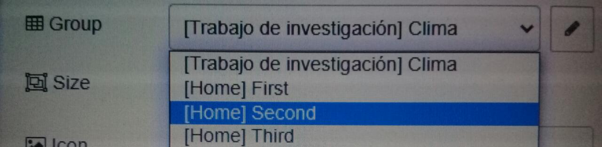
##### 7.1.2. Home First

##### Nodos Utilizados

Button : Agrega un botón a la interfaz del usuario el ícono se puede configurar usando los íconos Material,también se puede configurar el color y el color de fondo.

Slider :Un control deslizante horizontal simple, con un tamaño de paso variable.

Gauge :Este nodo es un tipo de indicador en el tablero,tiene 4 modos: estándar (indicador simple), donut (360 ° completo), brújula y onda.

Numeric :Un widget de entrada numérico con botones arriba / abajo.

Text :Text es una salida de texto que sirve para mostrar un campo de texto no editable en la interfaz.

Switch: El nodo Switch permite enrutar los mensajes a diferentes ramas de un flujo mediante la evaluación de un conjunto de reglas para cada mensaje.

Dropdown :Un widget de selección desplegable,agrega un cuadro de varias opciones a la interfaz del usuario.

##### Explicación.

Los nodos Botton los utilizamos para mostrar en la interfaz de usuario cada uno de ellos, para poder identificarlos en la parte de la etiqueta le colocamos el nombre con el cual queremos que se muestre en la interfaz final.

El nodo slider es un control deslizable manipulable por el usuario, el rango lo podemos modificar a nuestras necesidades, para poder ver de una manera mas visual el comportamiento del mismo, añadimos el nodo Gauge que es un indicador visual, los conectamos para que nos muestre la salida del nodo slider, el nodo numérico  nos ayudara también a modificar el valor de gauge solo que en vez de utilizar el slider ocuparemos flechas para subir o bajar, dependiendo de este número el nodo Text de salida lo verá reflejado e imprimirá cada número seleccionado.

Para agregar un interruptor a la interfaz del usuario ocuparemos el nodo  swich este nos devolverá dos estados, el nodo dropdown lo ocuparemos para desplegar un cuadro de opciones a la interfaz del usuario.
El nodo dropdown no esta conectado a otro nodo al igual que el nodo swich, ya que al pertenece al nodo Home Firts se imprimirán en la columna correspondiente. 

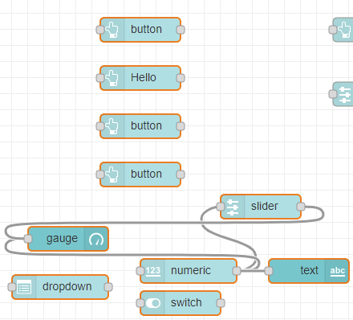
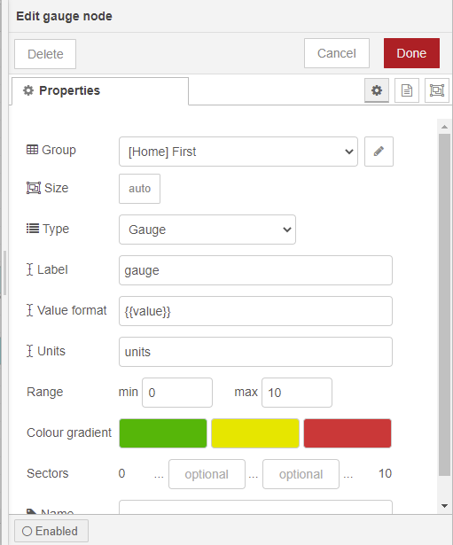

##### 7.1.3. Home Second

##### Nodos Utilizados

Button : Agrega un botón a la interfaz del usuario el ícono se puede configurar usando los íconos Material,también se puede configurar el color y el color de fondo.

Debug :El nodo de depuración se puede usar para mostrar mensajes en la barra lateral de depuración dentro del editor.

Text :Text es una salida de texto que sirve para mostrar un campo de texto no editable en la interfaz.

Slider :Un control deslizante horizontal simple, con un tamaño de paso variable.

Dropdown :Un widget de selección desplegable,agrega un cuadro de varias opciones a la interfaz del usuario.

Chart : Tiene modos de línea, barra y gráfico circular,podemos configurar el rango que nesesitamos.

Colour picker : Selector de color para un widget.

Gauge :Este nodo es un tipo de indicador en el tablero,tiene 4 modos: estándar (indicador simple), donut (360 ° completo), brújula y onda.

##### Explicación 

Para esta interfaz ocuparemos el grupo Home Second porque necesitamos que esta interfaz se coloque al lado derecho de la interfaz First

EL nodo button para que al momento de presionarlo salga un mensaje programado, para hacer esto debemos unir el nodo botón que es en donde configuraremos el mensaje con el nodo Text que es una salida de texto que sirve para mostrar un campo de texto en la interfaz.

Seguido de esto uniremos al nodo slider con los demás nodos, para que este pueda controlar la acciones de los otros. El nodo gauge es un indicador del tablero de modo grafico en el configuremos en rango que será de 0 a 200, del mismo modo el nodo chart nos devolverá una grafica de tipo barra con el mismo rango ya definido. El nodo Dropdown nos desplegara un cuadro con tres opciones diferentes programables, y el nodo Colour picker nos ayudara a seleccionar un color para nuestro widget.Todos estos nodos están enlazados al nodo principal slider que es un deslizador controlado por el usuario. 

Por ultimo utilizaremos el nodo debug para controlar la ejecucion del programa.

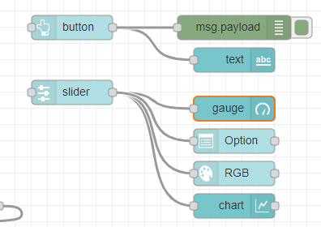.
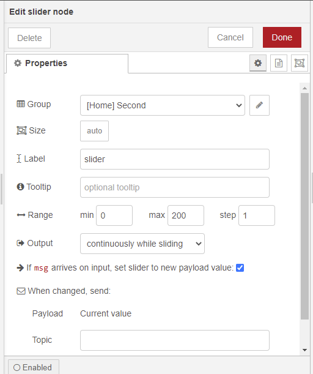.

##### 7.1.4. Home Third

##### Nodos Utilizados.

Slider :Un control deslizante horizontal simple, con un tamaño de paso variable.

Chart : Tiene modos de línea, barra y gráfico circular,podemos configurar el rango que nesesitamos.

##### 7.2. Explicación 
Para esta ultima interfaz ocuparemos el grupo Home third para que esta se ubique en una nueva columna así tendremos todas las interfaces en una distribución requerida.

Ocuparemos solo dos nodos el Slider y chart, el nodo slider tiene un control deslizante horizontal simple, esta nos servirá para controlar los nodos chart que están conectados a la slider principal. Los tres nodos chart hacen lo mismo, representan la información trasmitida por la slider en forma visual, cada uno de ellos de diferente manera y en un rango igual al del slider que es de 0 min a 200 max.

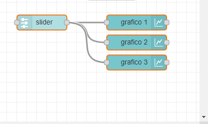.
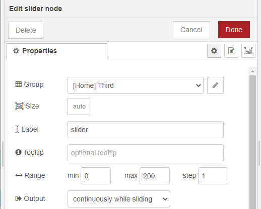.

#### Resultados

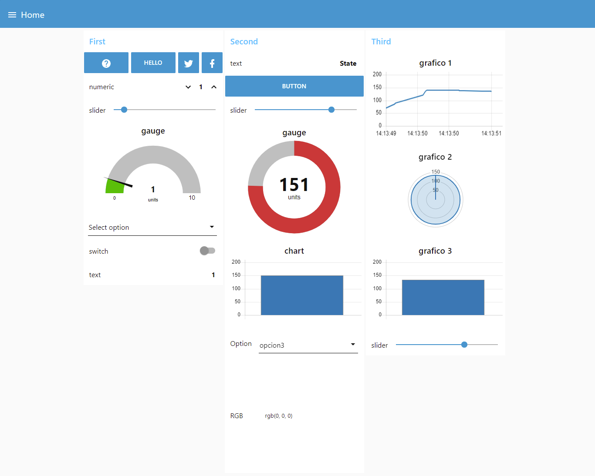.

#### 7.3. Calculadora científica con puertos GPIO
##### 7.3.1. Importación de librerías
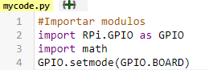

La línea 2 será la importación de los puertos GPIO de la Raspberry.

La línea 3 línea será la importación de la librería math la cual nos proporcionará las funciones matemáticas que necesitamos.

La línea 4 será el diseño en el cual se mostrará los puertos GPIO de la Raspberry.

##### 7.3.2. Creación de clase
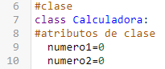

Se crea la clase con sus respectivos atributos.

##### 7.3.3. Constructor
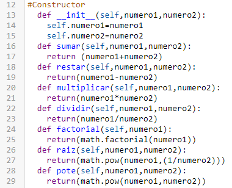

Definiremos las funciones con las cuales va a contar nuestra calculadora.

##### 7.3.4. Menú
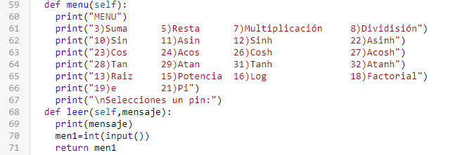

Mostraremos una guía para que el usuario puede seleccionar la opción que desea hacer.

##### 7.3.4. Funciones
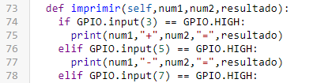  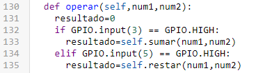

Las funciones imprimir y operar serán para operaciones los cuales requieran el ingreso de dos números.

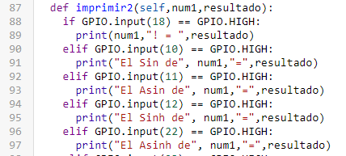  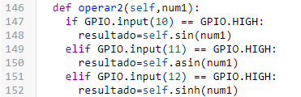

Las funciones imprimir2 y operar2 serán para operaciones los cuales requieran el ingreso de un solo número.

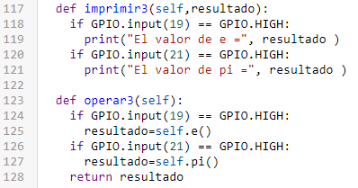  

Las funciones imprimir3 y operar3 serán para operaciones los cuales no requieran de ingreso de números como es el caso al observar el resultado de “e” y de “pi”.

  

Cuenta con la llamada a la clase, para poder usar todos los objetos hay presentes.
Una estructura de control while la cual permite que no muestre nada mientras no se seleccione un pin y varias estructuras if las cuales al detectar que un puerto ha sido seleccionado ejecutara o llamara a estrictos objetos que son fundamentales para su funcionamiento y una vez acabe de realizarlos termine.

##### 7.3.5. Resultados
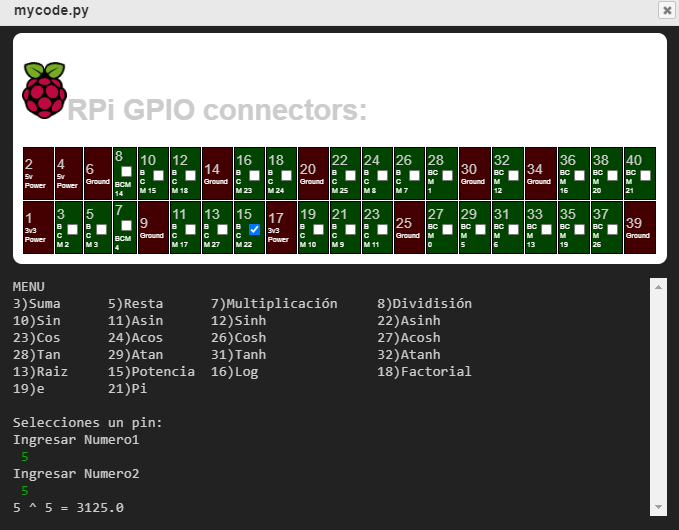

### 8. CONCLUSIONES
•	Node-Red te permite realizar varias interfaces HMI y una vez se domine esta forma de programación visual será podrá realizar granes ejemplos.

•	La página de Create With Code te permite practicar el lenguaje de programación Python sin la necesidad de descargar algún programa, además te permite simular 

### 9. RECOMENDACIONES
•	Consultar a fondo cada nodo utilizado en Node-Red para poder sacarle el máximo provecho a dicho nodo.

•	En el sitio web de la pagina Create With Code encontraras varios ejemplos que pueden ser de mucha ayuda.

### 10. CRONOGRAMA
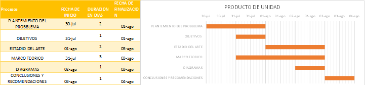

### 11. BIBLIOGRAFÍA

### 12. ANEXOS

#### 12.1. Manual de Usuario Freed
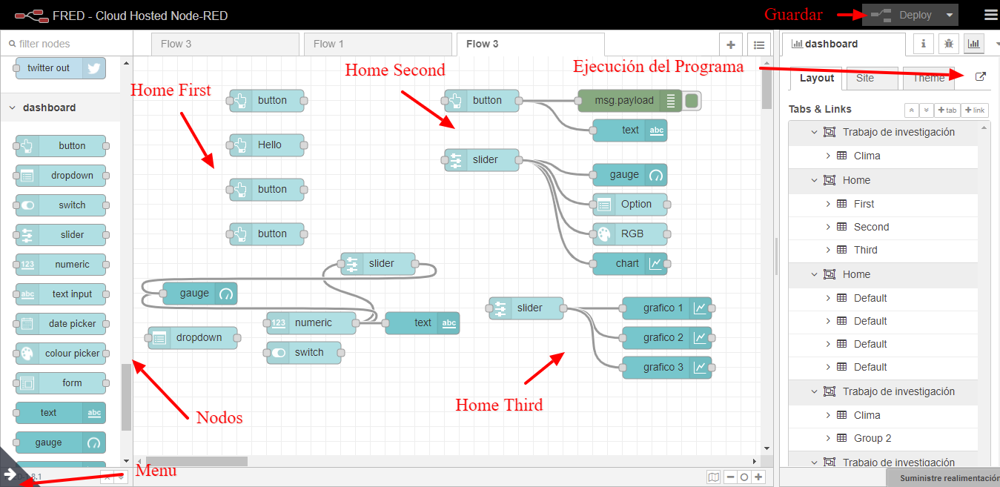

#### 12.2. Manual de Usuario Creat With Code

